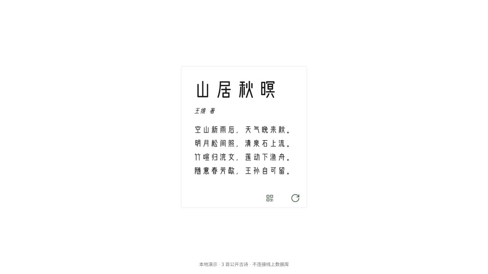
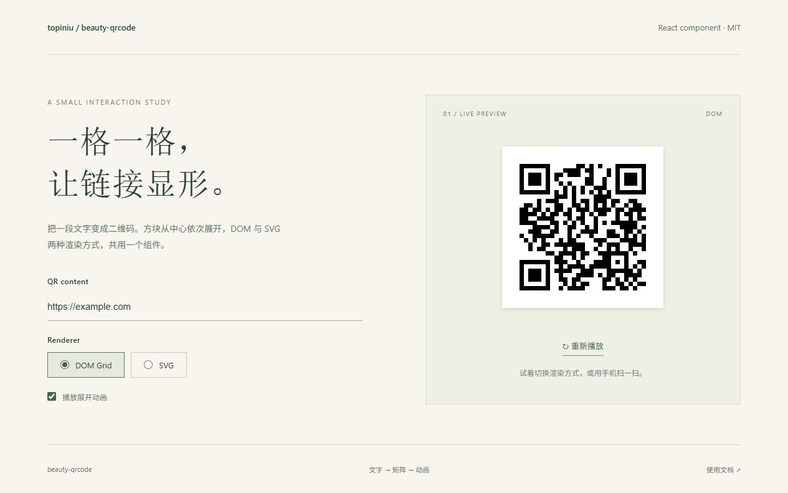

# 大满 · topiniu

做前端，也写服务端和工具。喜欢把一个想法做成能用的东西，再慢慢打磨使用时的细节。

我的仓库里有业务协作、浏览器测试，也有单词游戏、阅读与诗词。这里选了几件作品，方便你从实际界面和实现过程认识我。

**正在寻找前端 / 全栈工作机会，地区不限。** [邮件联系](mailto:beckxiong@gmail.com)

## 作品

### 01 / 在故事里练习英语

**Word / Scene Duel** · 交互、实时协作、学习产品

从双人单词游戏，到一个人也能慢慢读的故事花园。填写表达后，故事继续；词义、翻译和作答解释在阅读现场展开。对局中的房间状态与恢复、阅读中的反馈与节奏，是同一个产品里不同的问题。

[在线体验](https://wd.topiniu.com/#scene) · [实现与体验记录](cases/scene-duel.md)

### 02 / 让工作留下可检查的过程

**Office Lab × Zhuzhu** · Node.js、React、浏览器自动化

Office Lab 把需求、阻塞与人工验收放在一个任务看板里；Zhuzhu 把测试文件、执行步骤、截图和报告对应起来。我关心的是：发生了什么，卡在哪里，下一次如何重现。

[Office Lab：任务如何交接](cases/office-lab.md) · [Zhuzhu：一次真实测试](cases/zhuzhu.md)

<table>
  <tr>
    <td width="50%"></td>
    <td width="50%"></td>
  </tr>
  <tr>
    <td>任务看板：需求、状态、待确认问题。</td>
    <td>测试历史：2 个演示用例，7 个步骤实际通过。</td>
  </tr>
</table>

这些案例使用隔离的虚构业务数据。完整工作仓库保留私有，公开说明中写清了实际验证范围。

### 03 / 给阅读留一点位置

**Margin / 孟趣** · Next.js、阅读交互、逐字动效

Margin 让书里的摘录重新进入视线：卡片阅读墙、聚焦查看，再回到原来的位置。[阅读工具的实现与验证](cases/margin.md)

一屏只放一首诗。文字逐个出现，遇到生字可以看拼音，再把这首诗分享出去。它延续了我早期白诗集里的兴趣：让文字在屏幕上有合适的节奏。

[阅读这个小作品](cases/mengqu.md)

### 04 / 一个小组件，也值得琢磨

**beauty-qrcode** · React、TypeScript、DOM / SVG

让二维码从中心逐格显形。同一套 API 提供 DOM Grid 与 SVG 两种渲染方式，可以控制动效；演示页能直接比较它们。

[源码、演示录屏与使用方式](https://github.com/topiniu/beauty-qrcode)

## 更早的来路

- [IFE-Tasks](https://github.com/topiniu/IFE-Tasks)：从页面布局与 JavaScript 练习开始。
- [Blog](https://github.com/topiniu/Blog)：2017 年的学习与实习记录，保留当时遇到的问题。
- [FullTodo](https://github.com/topiniu/FullTodo)：早期 Vue 与 Java Servlet 的前后端实践。

学习仓库、协作项目和 fork 都留在仓库列表中；这里展示的是我希望继续投入的方向。欢迎从某个具体项目聊起。

