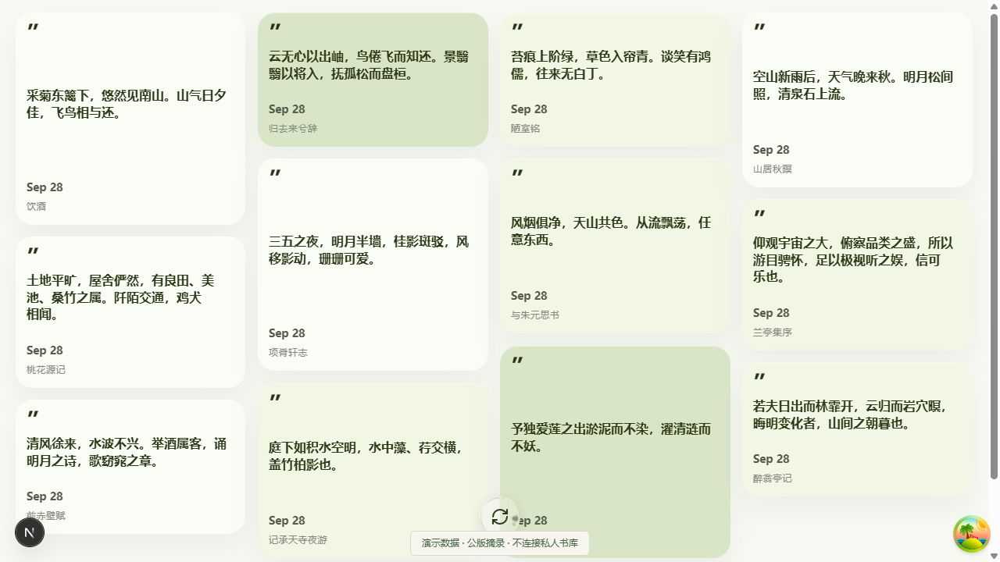
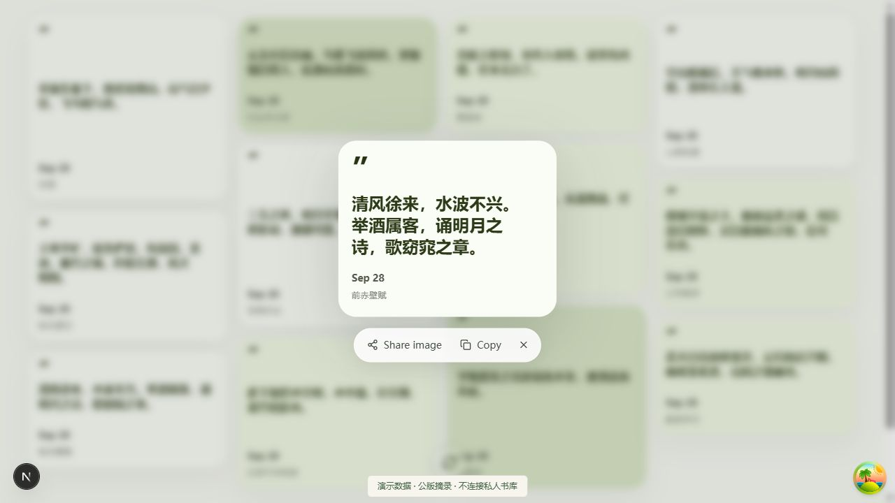

# Margin：让摘录重新进入视线

读书时划下的句子，往往很少再被打开。Margin 从摘录开始，把书库、阅读回顾与后续行动组织在一起；首页将摘录铺成卡片，点击后进入聚焦阅读，再回到原来的位置。

代码采用 Next.js、React Query、Prisma 与 PostgreSQL。导入解析与页面交互各自有边界：解析器处理原始摘录，服务端返回卡片需要的数据，客户端负责排列、焦点和阅读动作。

## 这次实际验证了什么

在独立副本中加入只读演示模式，使用 12 条公版诗文摘录。阅读墙、聚焦打开与关闭、刷新入口均实际操作；现有摘录解析器的 11 项测试通过。页面底部明确标注演示数据，截图来自开发模式，因此保留了开发工具入口。

演示配置没有连接私人书库，除公版摘录读取外的业务 API 均被关闭。本次没有验证真实账号登录、完整书库导入、AI 对话与行动生成，也没有将它们写成本次通过的结果。完整仓库保持私有。
