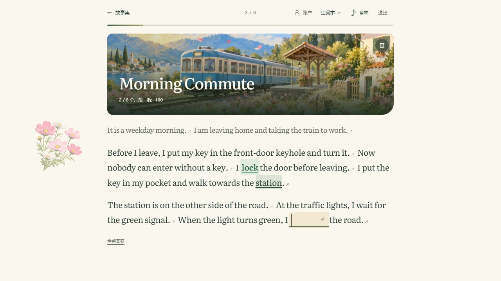

# Word / Scene Duel：让练习有下一步

[打开故事花园](https://wd.topiniu.com/#scene)

从双人单词游戏出发，这个项目逐渐加入了故事阅读：先读懂一段情境，填入自己的表达，再让故事继续。单词释义、整句翻译与作答解释留在阅读现场，不必反复离开当前段落。

## 产品里的两种节奏

Word Duel 用房间与对局连接两个人；Scene Duel 允许一个人慢慢读，也提供邀请好友的入口。它们共享词汇学习的目的，却需要不同的交互节奏：对局关心同步与恢复，阅读关心上下文、反馈和连续性。

画面采用纸张底色、植物与手绘场景，按钮和正文保持清楚的层次。动效可暂停，外观可切换，阅读时辅助信息按需展开。

## 本次体验记录

2026-09-28 在公开站点以访客进入 Morning Commute。第一段填写 `lock` 后，界面显示“表达正确 · +100”，进度进入第二段；点击答案可打开阅读助手查看作答详情。故事列表当时展示 19 篇故事。

截图来自线上版本。本次验证了访客单人练习和答案详情，没有据此宣称多人对局、断线恢复或全部故事均已通过回归测试。源码审阅与线上体验分开记录；本地开发目录有尚未提交的工作，本次没有覆盖或部署这些改动。

