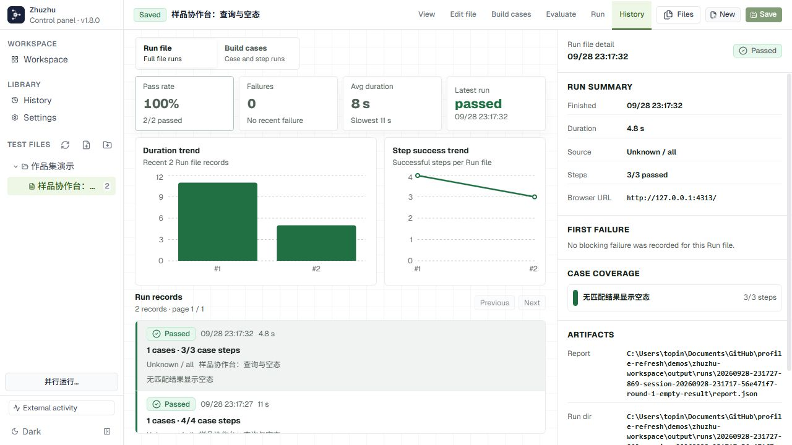

# Zhuzhu：执行之外，还要留下证据

自动化测试的价值不止于最后一个绿色状态。出现失败时，要能知道卡在哪一步、当时看到了什么，以及如何再次执行。Zhuzhu 以测试文件为入口，把用例、步骤、运行历史和截图报告组织在一起。

## 一次可复现的演示

这次使用独立的“样品协作台”测试页面，所有样品名称、编号和数量均为虚构数据。用例和截图由实际的 Zhuzhu 1.8.0 运行器产生，没有手工填入通过结果。

| 用例 | 检查内容 | 本次结果 |
| --- | --- | --- |
| 按名称筛选样品 | 输入名称、查询、检查目标名称与结果数量 | 4 / 4 步通过 |
| 无匹配结果显示空态 | 输入不存在的名称、查询、检查空态提示 | 3 / 3 步通过 |

执行日期：2026-09-28。方式：Headless Chromium。账号状态：空的 demo-guest 配置，不包含真实登录信息。用例预检查：0 错误、0 警告。

## 结构与边界

测试文件包含需求信息和多个 cases；运行器解释步骤、执行浏览器操作，并保存逐步截图、trace 与报告。React 面板读取同一工作区的文件与运行历史。界面编辑和运行产物因此可以围绕同一个测试文件对应起来。

Web 模式支持用例编辑及历史查看，执行由独立运行器完成；桌面模式另有受控浏览器。本次没有验证桌面 App-run，也没有测量生产业务的完整覆盖率。图中的 100% 只指这两条演示记录。

首次运行缺少 authProfile 时，运行器生成了 blocked 诊断；补上空的访客配置后重跑通过。失败与成功记录均保留在本地演示工作区。

完整仓库暂保持私有；业务用例、登录态及内部地址未进入公开素材。
